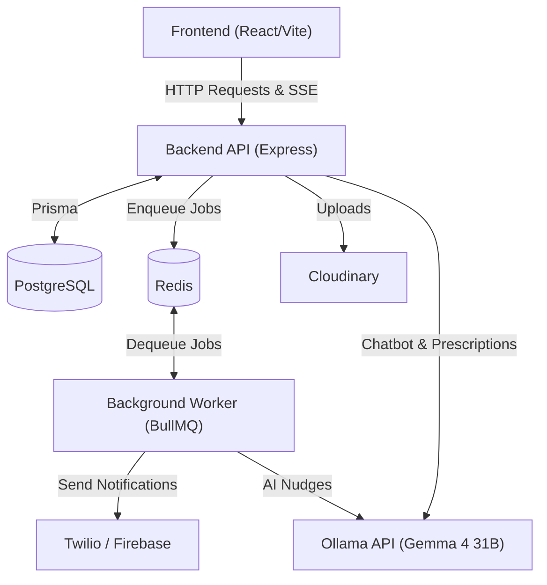

# MedKnock

MedKnock is a full-stack medication management application designed to help users track, log, and manage their medication schedules. It features dose logging, reminders, reporting, and integration with various APIs for notifications and scheduling.

## Features

- **User Authentication:** Secure login, authorization, Google OAuth integration, and Email OTP verification.
- **Medication Scheduling & Reminders:** Set up complex medication schedules.
- **Dose Logging:** Track taken, missed, or skipped doses.
- **Streak & Risk Score:** Gamification and health risk tracking based on adherence.
- **Multi-channel Notifications:** Automated reminders via Firebase (Push) and Twilio (WhatsApp).
- **AI-Powered Features:**
  - **AI Prescription Reader:** Extract medication details automatically from prescription images using Ollama (Gemma 4 31B model).
  - **AI Report Analyzer:** Gain personalized insights into your medication adherence and health reports.
- **Web Scraping:** Fetch up-to-date medicine data.
- **Responsive UI:** Modern frontend built with React and Tailwind CSS.

## Architecture

MedKnock uses a modern decoupled microservice-like architecture to ensure scalability, reliability, and responsiveness.

1. **Frontend (Vite + React):** 
   A fast, responsive single-page application (SPA) that interacts with the backend via RESTful APIs.
2. **Backend API (Node.js + Express):** 
   Handles incoming HTTP requests, business logic, and authentication. It directly interfaces with the primary database for fast synchronous operations.
3. **Database (PostgreSQL via Prisma ORM):** 
   The primary relational database storing users, schedules, doses, and reports.
4. **Queue & Cache (Redis):** 
   Used by BullMQ to securely queue background jobs, manage delays (like sending a reminder at a specific time), and cache temporary data.
5. **Background Worker (Node.js + BullMQ):** 
   A dedicated Node.js process that constantly polls Redis for background jobs. It executes time-consuming or scheduled tasks (like sending out WhatsApp notifications, processing AI reports, and triggering emails) behind the scenes, ensuring the main API never hangs or blocks user requests.

### High-Level Flow


## Tech Stack

- **Frontend:** React, Vite, Tailwind CSS
- **Backend:** Node.js, Express, Prisma ORM
- **Databases:** PostgreSQL (Primary), Redis (Queue/Cache)
- **Background Jobs:** BullMQ
- **AI & ML:** Ollama (Gemma 4 31B model)
- **Authentication (OTP):** Nodemailer (Gmail SMTP)
- **Notifications:** Firebase (Push), Twilio (WhatsApp)
- **File Storage:** Cloudinary

## Project Structure

```text
MedKnock/
├── frontend/             # React source code
│   ├── src/
│   │   ├── components/   # Reusable UI components
│   │   ├── pages/        # Page components
│   │   └── hooks/        # Custom React hooks
│   └── .env              # Frontend environment variables
│
├── backend/              # Node.js API & Worker
│   ├── server.js         # Entry point for Backend API
│   ├── worker.js         # Entry point for Background Worker
│   ├── prisma/           # PostgreSQL schema and migrations
│   ├── controller/       # Express route controllers
│   ├── services/         # Core business logic (UserService, ScheduleService, etc.)
│   ├── routes/           # API route definitions
│   ├── middlewares/      # Express middlewares (Authentication, Uploads)
│   ├── config/           # App and external service configs (Prisma, Firebase, Passport)
│   ├── workers/          # BullMQ job processors & queues
│   ├── utils/            # Third-party integration clients (Ollama, Twilio, Nodemailer)
│   └── .env              # Backend environment variables
│
├── rollout.yaml          # Infrastructure deployment configuration
└── docker-compose.yml    # Local Docker setup for PostgreSQL & Redis
```

## Getting Started

### Prerequisites
- Node.js (v18+ recommended)
- Docker & Docker Compose (for running local databases)

### Backend Setup
1. Start the required databases (PostgreSQL & Redis) locally:
   ```sh
   docker-compose up -d
   ```
2. Navigate to the `backend` folder:
   ```sh
   cd backend
   ```
3. Install dependencies:
   ```sh
   npm install
   ```
4. Set up the database:
   Create a `.env` file based on `.env.example` (which includes local `DATABASE_URL` and `REDIS_URL` defaults) and push the schema:
   ```sh
   npx prisma generate
   npx prisma db push
   ```
5. Start the API server:
   ```sh
   npm run dev
   ```
6. Start the Background Worker (in a separate terminal):
   ```sh
   npm run worker
   ```

### Frontend Setup
1. Navigate to the `frontend` folder:
   ```sh
   cd ../frontend
   ```
2. Install dependencies:
   ```sh
   npm install
   ```
3. Configure the `.env` file with `VITE_BACKEND_URL=http://localhost:5000` (or your chosen API port).
4. Start the development server:
   ```sh
   npm run dev
   ```

## Contributing
Pull requests are welcome! For major changes, please open an issue first to discuss what you would like to change.
